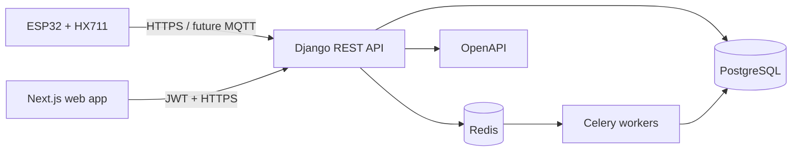

# Architecture

## Context

LPG Guardian receives calibrated cylinder-weight telemetry from ESP32 devices using an HX711 load-cell amplifier. The platform separates device ingestion, transactional APIs, asynchronous processing, and user-facing analytics so each can scale independently.

## Boundaries

- `apps/frontend`: browser UI, validation, server/client rendering, query caching.
- `apps/backend`: API, authentication boundary, persistence, orchestration, background jobs.
- `packages/shared`: framework-neutral TypeScript contracts generated or curated from the API.
- PostgreSQL is the source of truth. Redis is transient infrastructure and must not hold unique business data.
- ESP32 device identity and ingestion protocols are intentionally deferred to Milestone 4.

## Quality attributes

- Security: TLS at ingress, short-lived access JWTs, refresh rotation, least privilege, secret injection, audit-ready events.
- Reliability: idempotent ingestion, database constraints, bounded task retries, health checks, and graceful degradation.
- Scalability: stateless web/API services, horizontally scalable workers, indexed time-series access patterns.
- Observability: structured logs, request correlation, metrics, traces, device last-seen and task failure signals.
- Maintainability: versioned APIs, OpenAPI as contract, modular Django apps, strict TypeScript, automated gates.

## Architecture decisions

Important decisions are recorded in `docs/adr/` using the ADR template. Changes to authentication, device protocols, data retention, or deployment topology require an ADR.
